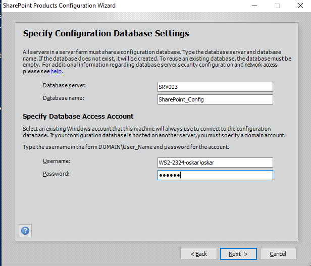
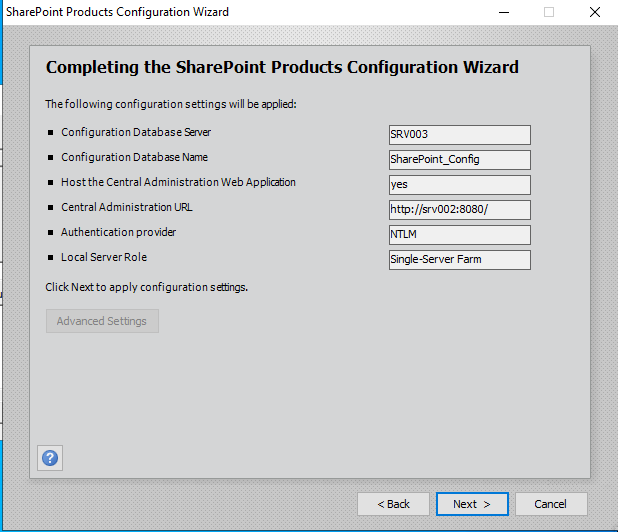
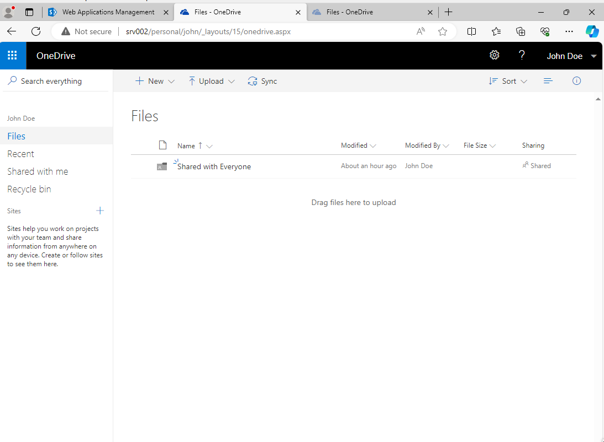

# Deployment Guide

> Author: Oskar Münstermann
> 
> Date: 09.11.2023

This deployment guide describes which steps need to be performed in order to replicate my windows server lab environment.

## Directory Structure

The directory structure follows a pattern, which depicts in which order the scripts have to be executed. Refer to the following instructions for more details. 

The provisioning scripts were initally developed on Linux, thats why there is also a bash version of the provisioning scripts available.
The provisioning scripts were only tested on a Linux notebook, but should also work under Windows.

```
└── scripts
    ├── client
    ├── domcon
    ├── provision
    │   └── bash
    ├── sharepoint
    └── sqlserver
```

## Set ISO Paths

- go to `scripts/provision/1-provision.ps1` and fill in the following variables at the top according to your system
  - VM_BASE_FOLDER - Virtualbox Base folder (where your vms are stored)
  - WS_ISO_PATH # Windows Server ISO
  - W10_ISO_PATH # Windows 10 ISO

- go to `scripts/provision/2-mount-install-mediums.ps1` and fill in the following variables according to your system
  - SQL_ISO_Path # SQL Server ISO
  - SP_Image_Path # Sharepoint ISO

## Execute Provisioning Scripts

To be executed on your **host system**:

1. make sure VirtualBox is installed and running
2. cd into `scripts/provision`
3. execute `0-natnetwork.ps1` ro create the NAT Network.
4. execute `1-provision.ps1` to provision and start the unattended installation of all machines.
5. when all the installations have finished installing, execute `2-mount-install-mediums.ps1`
6. reboot all the machines, e.g. using `3-restart-vms.ps1`
7. verify that the shared folder share-*vmname* is available at `H:\` on all machines
8. Verify that the install mediums for sharepoint and sqlserver show up in the respective machines

## User overview

- **oskar**
  - Password: `123456`
  - local user created on all machines through the installation process
- **WS2-2324-oskar\oskar**
  - Password: `123456`
  - Permissions: Domain Admin, Enterprise Admin, SQL Server Admin
  - do all configuration with this user
- **WS2-2324-oskar\john**
  - Password: `Password123!` (to conform with the password policy ;))
  - regular domain user without special permissions

## Set keyboard layout

The standard layout on the Windows machines is sete to US / QWERTY. Execute `H:\scripts\keyboard-layout.ps1` to change yours. Mine was `de_AT`. You might want to change that to yours.

## Configure the Domain Controller

To be executed on the machine **srv001** (remote or desktop powershell as (Domain-) Administrator):

> When asked for a "yes" or "run", just accept everything

1. Execute `Set-ExecutionPolicy Unrestricted` to allow execution of PS scripts.
2. goto `H:\domcon`
3. run `0-network.ps1` to configure networking
4. run `1-active-directory` to install the AD Services
5. the machine will reboot, let it finish its thing
6. run `2-dns.ps1` to configure the reverse dns zones
7. run `3-dhcp.ps1` to configure dhcp
8. run `4-ca.ps1` to set up the root ca

**Optional:**
verify the correct installation of the root ca:
```
certutil -viewstore "ldap:///CN=ws2-2324-oskar-SRV001-CA,CN=Certification Authorities,CN=Public Key Services,CN=Services,CN=Configuration,DC=ws2-2324-oskar,DC=hogent?cACertificate?base?objectClass=certificationAuthority"
```

## Configure the SQL Server

To be executed on the machine **srv003** (remote or desktop powershell as (Domain-) Administrator): 

1. Execute `Set-ExecutionPolicy Unrestricted` to allow execution of PS scripts.
2. goto `H:\sqlserver`
3. run `0-network.ps1` to configure networking
4. run `1-active-directory.ps1` to join to the domain
5. Make sure, that `H:` is the shared folder and `D:` is the sqlserver installation media, check with `Get-PSDrive`
6. run `2-installation.ps1` to install the sql server software
7. run `3-configuration.ps1` to install sqlcmd, firewall rules
8. open the SQL Server PowerShell with `sqlps.exe`
   - run `H:\sqlserver\sqlps.ps1` to enable TCP/IP
   - `exit` to the regular powershell
9. check with `netstat -a`, if port 1433 is exposed

### Secondary DNS

- run `4-dns-secondary.ps1`

To be executed on **srv001** / DC
1. open the DNS Config GUI -> Zone -> Properties -> Zone Transfer
2. allow zone transfers only for the dns servers

## Configure SQL Server management Studio

To be executed on the machine **srv001** (ws001 would work as well) (remote or desktop powershell as (Domain-) Administrator): 

1. run `H:\domcon\ssms.ps1` to install the software, it should automatically download the setup file and run it quietly.
2. open SSMS
3. connect to `SRV003` with Windows authentication and the user `WS2-2324-oskar\oskar`

## Configure the Sharepoint Server

To be executed on the machine **srv002** (desktop powershell as (Domain-) Administrator):

1. Execute `Set-ExecutionPolicy Unrestricted` to allow execution of PS scripts.
2. goto `H:\sharepoint`
3. run `0-network.ps1` to configure networking
4. run `1-active-directory.ps1` to join the domain.
5. run `2-sharepoint-prereq.ps1` and click through the installer. The script will ask you to restart the pc, type 'y'
6. run `3-sharepoint-setup.ps1`
   - enter your product key
   - accept the license
   - hit Install now
   - uncheck the checkmark to run the config wizard
   - hit yes to reboot
7. configure sharepoint
   - run the **sharepoint product config wizard**
   - enter the db server name and credentials
    
   - enter a passphrase, e.g. 'Password123!'
   - Select 'Single-Server Farm' as Server Role
   - specify a port number for the administration application, e.g. 8080
   - leave NTLM as auth
   
   - browse to "http://srv002:8080" to verify the installation succeeded

## OneDrive

Follow this tutorial exactly as it says, it is very detailed and explains every step:
https://learn.microsoft.com/en-us/sharepoint/sites/set-up-onedrive-for-business#setup

If you follow the instructions from part "Set up the required services", after a reboot, the OneDrive should work properly and be available to all users. Test this with the domain user `john` and browse to `srv002.ws2-2324-oskar.hogent`

Automating this was unfortunately not possible :-(




# Configure an SSH Server

1. Execute `scripts/ssh.ps1`
2. Enable Port forwarding in VirtualBox: `VBoxManage modifyvm "VM name" --natpf1 "guestssh,tcp,127.0.0.1,2222,192.168.23.XX,22"`
3. connect via ssh on the host: `ssh user@127.0.0.1 -p 2222`

Use this ssh config for convenience to use a remote PowerShell:
```
Host myhost
        HostName localhost
        Port 2210
        User "WS2-2324-oskar\oskar"
        RequestTTY force
        RemoteCommand powershell
```