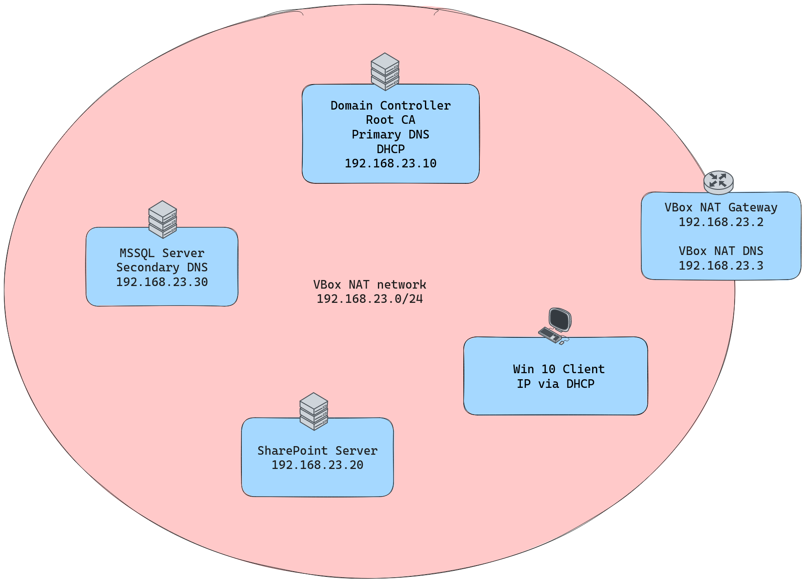
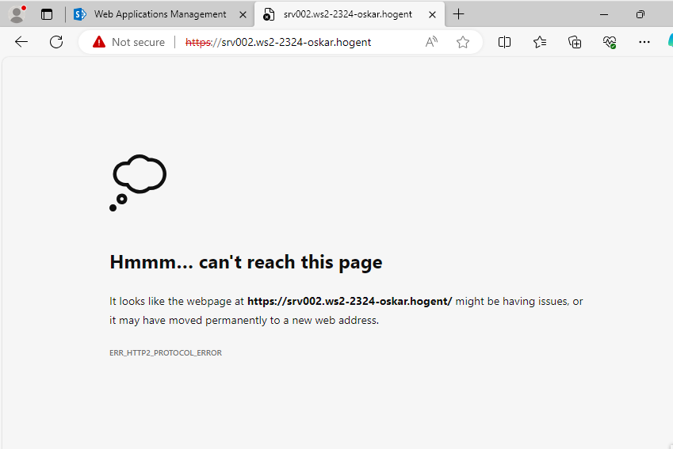

> Author: Oskar Münstermann
> 
> Class: Windows Server II
> 
> Date: 09.12.2023

# Setup

| Hostname | Services                                         | CPU | OS              | RAM   | Disk          |
|----------|--------------------------------------------------|-----|-----------------|-------|---------------|
| srv001   | AD Domain Controller, Primary DNS, Root CA, DHCP | 1   | WS 2022 Desktop | 2048M | 64G (dynamic) |
| srv002   | SharePoint                                       | 1   | WS 2022 Desktop | 4096M | 64G (dynamic) |
| srv003   | SQL Server, Secondary DNS                        | 2   | WS 2022 Core    | 2048M | 64G (dynamic) |
| ws001    | Windows 10 client                                | 1   | Windows 10      | 2048M | 64G (dynamic) |

| Hostname | IP            | DNS           | Gateway      |
|----------|---------------|---------------|--------------|
| srv001   | 192.168.23.10 | 192.168.23.3  | 192.168.23.2 |
| srv002   | 192.168.23.20 | 192.168.23.10 | 192.168.23.2 |
| srv003   | 192.168.23.30 | 192.168.23.10 | 192.168.23.2 |
| ws001    | DHCP          | 192.168.23.10 | 192.168.23.2 |



# Motivations behind decisions

I to sticked to the minmum of 3 Windows Server VMs plus one Client VM. So I had to make a few tradeoffs regarding the seperation of services on different machines. My thought-process was the following:

- The Domain Controller has to be a seperate machine, first machine
- SharePoint and MSSQL would probably lead a bottleneck if run on one machine, so seperate them, makes machine two and three.
- The other network services (DNS1, DHCP) and the Root CA also run on the Domain Controller except for the secondary DNS, which obviously has to run on another machine, I chose the Database Machine.
- I gave every machine 64G of dynamically allocated storage, which is enough space for all services. For the RAM I really exceeded my system resources (16GB) by giving every machine 2G, except for the Sharepoint VM, that got 4G. This should ensure a relatively smooth working test environment with no memory issues. Another exception, only the Sharepoint vm got 2 cpu cores instead of one for the same reason.
  - *Initial thoughts: For the resources, I doubled the minimum of 32G disk size for the server machines to 64G to be sure to have enough space. The machines with a GUI get 128G. Same for the RAM, 1G for WS Core machines, 2G for client and dc.*
- Additionally, I decided to install an SSH server on ever machine to be able to remotely manage the machines from my host. This not only eliminated the urge to do stuff on the gui, but also made switching between the machines and copy-pasting commands way easier.

# Problems

- As my host system is an Arch Linux derivate, I had to install the package `virtualbox-unattended-templates-7.0.10-1` from the AUR.
- I had to install PowerShell on my Linux host in order to write and test the provisioning scripts. Initially, I wrote them in Bash. Retrospectively, I should've started with PowerShell right away, it's not too big of a difference in that case.
- The shared folder wouldn't show up for any reason after the initial boot, only after rebooting once. Don't know why that does not work right away.

## Sharepoint

### Configuration

At first I wanted to configure Sharepoint using the `psconfig.exe` utility instead of using the UI Version. I experimented with the utility but the built in help is so bad and there is hardly any good documentation for it available. This was my best shot:
```ps1
Start-Process -FilePath 'C:\Program Files\Common Files\microsoft shared\Web Server Extensions\16\BIN\psconfig.exe' `
    -ArgumentList `
    '-cmd configdb -create -server "SRV003" -database "Sharepoint_Config" -dbuser "WS2-2324-oskar\oskar" -dbpassword "123456" -user "WS2-2324-oskar\oskar" -password "123456" -passphrase "Password123!" -localserverrole "Single-Server Farm"', `
    '-cmd helpcollections', `
    '-cmd secureresources', `
    '-cmd services', `
    '-cmd installfeatures', `
    '-cmd adminvs -provision', `
    '-cmd ssl', `
    '-cmd applicationcontent -install', `
    '-cmd upgrade' `
    -Wait
    -NoNewWindow
```
In the end, I just left with `psconfigui.exe` and let the GUI Magic do its thing.

Additionally, I increased the RAM to 4GiB, because the first installation failed and threw an error due to lack of memory.

### Installing the Certificate

I ran into problems, when configuring the SharePoint web Application with an SSL Certificate. Creating the certificate worked fine, but serving the app on port 443 with https enabled kept throwing an error that I didn't solve yet.



## Secondary DNS

I also didn't make the secondary DNS server fully work. There must be an issue with the zone transfer settings or the allowed dns resolvers in the domain. I tried fixing the problem via the DNS GUI on the DC first, but it did not resolve the issue.

# Status

**Before 1st Deadline**

- I created the VM setup as a table and a network diagram depicting my planned setup.
- Apart from that I started creating the automation scripts, because I try to skip the manual install process. 
- I created the first version of the lab documentation

**Before 2nd Deadline**

- I created scripts for creating the NatNetwork and provisioning all 4 machines using VBoxManage.
- Additionally, I started on configuring networking on the machines.
- On the Domain Controller, I installed an Active Directory Forest.
- updated the lab documentation
- wrote the first deployment manual

**Before 3rd Deadline**

- successfully set up an Active directory & the Primary DNS server on the Domain controller
- joined all hosts to the AD
- configured the DHCP server successfully
- installed & configured the SQL server instance
  - installed SSMS on the DC to test the SQL Server
- set up SharePoint
  - configured SharePoint installation in AD
  - set up OneDrive for Business
  - test functionality on regular user on the client
- installed a Root CA on the DC
- improved network diagram

**Summary:**

What does not work?
- SSL on Sharepoint
- Secondary DNS

everything else works!

# Conclusion

As this was my first real encounter with a windows server environment, I am quite happy about how it turned out. I almost got all services working as expected. However, the research process was quite intense and finding the right documentation, especially for the scripting part, was very tough.

Even though I totally tried to skip every GUI installation possible in the first place, I spent way too much time figuring out how to install the SharePoint only via the CLI which was pointless after all - a rabbit hole to avoid next time.

From what I've learned from this exercise, Windows environments are very tough to set up. Not necessarily because it's so diffucult, but rather because everything takes a fortune and restarts are all over the place. This made troubleshooting so frustrating and the fact that you feel like you never *really* know what you're doing and what's happening in the background is a real downer sometimes.

Nevertheless, I am happy to have gained all the experience!


# Resources

## SQL Server Resources

Some documentation that I found very useful.

installation guides:

https://learn.microsoft.com/en-us/sql/database-engine/install-windows/install-sql-server-from-the-command-prompt?view=sql-server-ver16

https://learn.microsoft.com/en-us/sql/database-engine/install-windows/install-sql-server-on-server-core?view=sql-server-ver16

https://learn.microsoft.com/en-us/sql/database-engine/install-windows/configure-sql-server-on-a-server-core-installation?view=sql-server-ver16

https://github.com/colaberry/training/blob/master/sqlbi/installations/install_apps.ps1

**sqlcmd:**

https://learn.microsoft.com/en-us/sql/tools/sqlcmd/sqlcmd-utility?view=sql-server-ver16&tabs=odbc%2Clinux&pivots=cs1-bash

**firewall:**

https://learn.microsoft.com/en-us/sql/sql-server/install/configure-the-windows-firewall-to-allow-sql-server-access?view=sql-server-ver16

**ssms:**

https://learn.microsoft.com/en-us/sql/ssms/download-sql-server-management-studio-ssms?view=sql-server-ver15
https://learn.microsoft.com/en-us/sql/ssms/quickstarts/ssms-connect-query-sql-server?view=sql-server-ver15

## DHCP

https://learn.microsoft.com/en-us/windows-server/networking/technologies/dhcp/quickstart-install-configure-dhcp-server?tabs=powershell

## CA

https://learn.microsoft.com/en-us/powershell/module/adcsdeployment/install-adcscertificationauthority?view=windowsserver2022-ps

https://learn.microsoft.com/en-us/windows-server/networking/core-network-guide/cncg/server-certs/install-the-certification-authority

## OneDrive

https://learn.microsoft.com/en-us/sharepoint/sites/set-up-onedrive-for-business

## Secondary DNS

https://learn.microsoft.com/en-us/powershell/module/dnsserver/add-dnsserversecondaryzone?view=windowsserver2022-ps